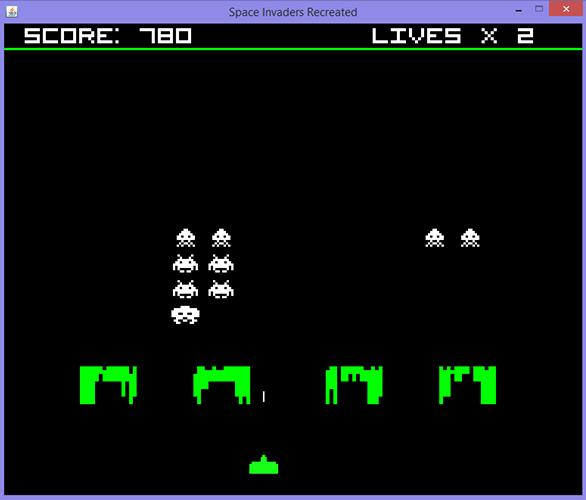

space-invaders-recreated
========================

A recreation of **Space Invaders** in Java.

This repository includes a Lua script addon that can be used to allow gesture control using Thalmic Labs's Myo armband.

Space Invaders is copyrighted by Taito Corporation. This code is provided by me on a GNU GPL v3.0 license.

#### Screenshot



### Installation

If you are on Windows, ensure that you have the [JDK](http://www.oracle.com/technetwork/java/javase/downloads/jdk8-downloads-2133151.html) installed.

From the `space-invaders-recreated` directory on command line/terminal, enter the following to compile the code:

```$ javac -d . @compile.txt```

To run Space Invaders Recreated after compiling, enter:

```$ java SpaceInvaders```

To enable Myo controls for the game, add `src/SpaceInvadersRecreated.myo` to Myo Connect's Application Manager.

#### Controls

* **Left/Right Arrow** (**Roll Left/Right** on Myo) - Move ship across screen.
* **Space** (**Fist** on Myo) - Fire!
* **P** - Pause game.

#### Changelog
* **1.0** (Feb 2013) - Initial version.
* **1.1** (19 Jul 2014) - Refactoring and some improvements.
* **1.2** (8 Sep 2014) - Added rudimentary Myo support through a Lua script.
* **1.2.1** (12 Sep 2014) - Lua code fixes and cleanup; removed fist move functionality.
* **2.0** (26 Sep 2014) - Major update! Game now has sound, pausing, main menu and other UI enhancements.
* **2.0.1** (9 Nov 2014) - Revise Lua plugin controls to make gameplay easier.